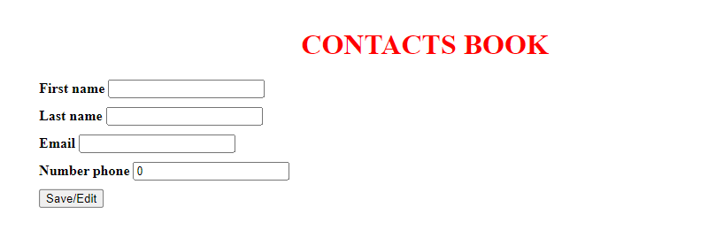
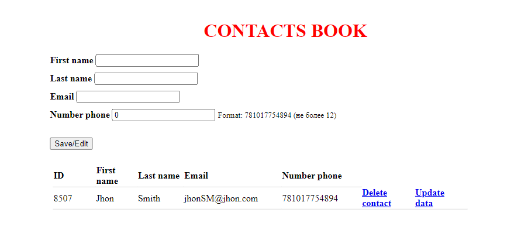
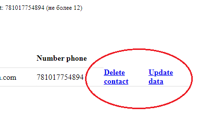

<h1 align="center">Contacts Book</h1>
<h3 align="center">Contents:</h3>
1. Resume 
2. User interface 
3. API and application structure 
4. Technologies used 
5. Launching the application

____
### I. RESUME

Welcome, in front of you is the contact book application. 

The application allows you to control 
and manage your contact book in a convenient and 
simple interface. You have access to such useful 
functions as: save, add, delete and change contacts.

==================

### II. USER INTERFACE

The application interface is an implementation 
of the index.html file, which is essentially a view 
in the process of processing a request by the Spring framework.

I wrote the file using html and the thymeleaf template engine.

When you open the application, you 
immediately have the opportunity to 
specify the details of a new “contact” 
and immediately save it to the database or change it there.

After adding a contact, it will appear 
below the data filling form. In the contact 
list, in addition to the fields that you specified 
(First name, Last name, Email, Number phone), you 
can also see the contact id that was automatically 
assigned to it on the application server.

For each contact you can immediately select two functions, either delete it or change it.

When you delete a contact, you will be removed from the database, 
and when you change it, by clicking on the button, all fields in the 
form above will be filled in with the data of the selected contact.

==========================

### III. API AND APPLICATION STRUCTURE

The application structure implies the concept of Spring MVC architecture.
The architecture is represented by 7 main directories:
1) Controllers
2) Exceptions
3) Model
4) Repositories
5) Services
6) Utils
7) Resources

1. Here is the application controller,
which is responsible for processing user requests coming from the UI (PhoneBookController).
   This is where the following request handlers occur:</b>
   * Open the main application page (_contacts (Model model)_ by link "http://localhost:8080/")
   * Save contact to book (_saveContact (Contact contact)_ by link "http://localhost:8080/contacts/save")
   * Editing by selected contact, namely by its ID (_inputEditData(Long id, Model model)_ by link "http://localhost:8080/contacts/update/{id}")
   * Delete the contact by its ID (_deleteContact (Long id)_ by link "http://localhost:8080/contacts/delete/{id}")
2. Here is an exception that is thrown if the contact by ID was 
not found when processing a request from the user in the Data access layer.
3. This layer is responsible for storing, processing and transmitting data between components. Namely, this is where 
the Contact entity is located, which, 
by its logic, has such characteristics as: ID, First name, Last name, Email, Number phone.
4. This layer is responsible for the data access layer and data management.
   Here is the repository (interface and its implementation) of the application, where user requests from the UI are processed 
through interaction with the database using the JDBCTemplate.
   As in the controller, you can find functions here such as: displaying all contacts, 
adding them to the database, removing them from the database, 
or editing any characteristics of the entity.
5. This layer is a business logic layer. The controller, 
having received a request from the UI, transmits processing 
of the incoming data to this layer.
Here there is a service (interface and its implementation) 
in which requests are processed with delegation of receiving 
a response to the repository.
6. Here are third-party or additional application classes that are 
necessary for its operation and that are not part of Spring
7. This folder stores the characteristics of the application in which, in this case, the connection to the database is made, as well as an 
indication of the logging level that will be displayed in the console.

==========================

### IV. TECHNOLOGIES USED

The application used technologies and versions such as:

* Framework Spring - 6 v.
* Spring boot - 3.2.0 v.
* Java - 20 v.
* Thymeleaf
* Gradle - 8.5 v.
* Docker - 3 v.

==========================

### V. LAUNCHING THE APPLICATION

To run the application, you need a development environment and 
running on Docker in the OS.
Also, before launching the application, you need to make sure 
that the docker-compose.yml and init.sql files contain the correct 
data for creating and connecting to the database, as well as the 
correct logic for creating the necessary schema and its components, table and entity.

As soon as the above is done. The database needs to be started. To do 
this, you need to go to the console and go to the location folder, you 
need to issue the docker command “docker compose up”.
Next, if the database is successfully launched, then you need to launch 
the application in the environment in Run or Debug mode (if you need to 
see the logs in the console)

==========================

